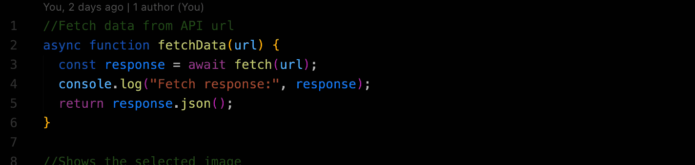

<!-- Resources -->
<!-- Icons: https://simpleicons.org/ -->
<!-- GitHub Stats: https://github.com/anuraghazra/github-readme-stats -->
<!-- Emojis: https://emojipedia.org/emoji/ -->
<!-- HTML Emojis: https://www.fileformat.info/index.htm -->
<!-- Shields: https://shields.io/ -->
<!-- Awesome GitHub Profile README: https://github.com/abhisheknaiidu/awesome-github-profile-readme -->

## 👋 Bio

My name is Danijel Cvitkusic. I'm from the Netherlands :netherlands: and I'm currently doing a 7-month bootcamp to become a full stack web developer :technologist: at HackYourFuture. I like all things art :art: and in my spare time I like to tinker with retro computers .

## :speech_balloon: Social

## :abacus: Technology & Tools

## :bar_chart: Github stats

